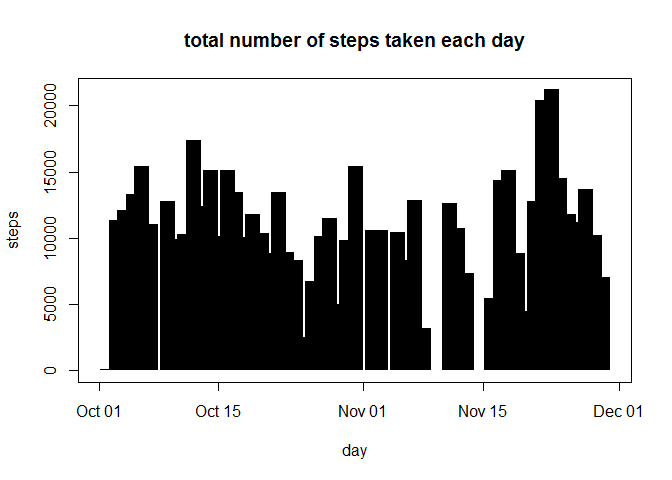
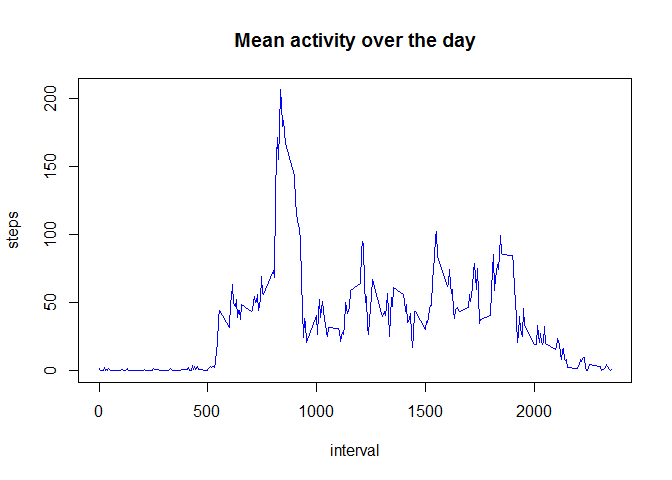
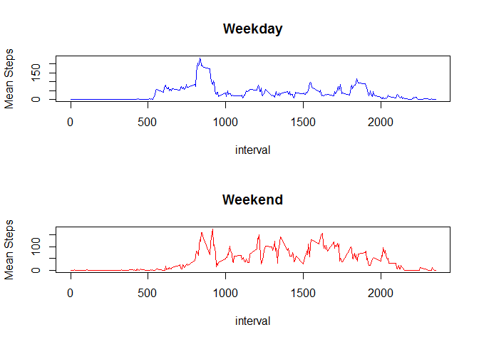

# Reproducible Research: Peer Assessment 1


1. Loading and preprocessing the data
  1.1 Reading the data into R


```r
activity <- read.csv("activity.csv", colClasses = c("numeric", "Date", "numeric"))
```
  1.2 Adding the weekend / weekday indicator necessary later on
  

```r
activity$day_of_week <-weekdays(activity$date)
activity$isWeekend <-ifelse(activity$day_of_week == "Sunday" | activity$day_of_week == "Saturday", 1, 0)
```

2. What is mean total number of steps taken per day?
  2.1 Calculate the total number of steps taken per day 


```r
require(plyr)
```

```
## Loading required package: plyr
```

```r
activityByDay <-ddply(activity, ~date, summarise, sum=sum(steps,na.rm = TRUE ), mean=mean(steps, na.rm = TRUE), median=median(steps, na.rm = TRUE) )
```
  2.2 Make a histogram of the total number of steps taken each day

```r
plot(activityByDay$date, activityByDay$sum,  type = "h", lwd=15, lend=1, main = "total number of steps taken each day", xlab = "day", ylab = "steps" )
```

<!-- -->

  2.3 Calculate and report the mean and median of the total number of steps taken per day (table suppressed because it is +200 lines)

```r
c(activityByDay$date, activityByDay$mean)
c(activityByDay$date, activityByDay$median)
```


3. What is the average daily activity pattern?

  3.1 Make a time series plot

```r
activityByInt <-ddply(activity, ~interval, summarise, mean=mean(steps, na.rm = TRUE) )

plot(activityByInt$interval, activityByInt$mean, type = "l", col="blue", main = "Mean activity over the day", xlab = "interval", ylab = "steps")
```

<!-- -->

  3.2 Which 5-minute interval, on average across all the days in the dataset, contains the maximum number of steps?

```r
indexMax <- which.max(activityByInt$mean)
print(activityByInt$mean[indexMax])
```

```
## [1] 206.1698
```


4. Imputing missing values
  4.1 Calculate and report the total number of missing values in the dataset

```r
sum(is.na(activity$steps))
```

```
## [1] 2304
```

  4.2 Devise a strategy for filling in all of the missing values in the dataset - Fill all NAs with 0 (otherwise overreporting)
  4.3 Create a new dataset that is equal to the original dataset but with the missing data filled in

```r
activityNoNA <- activity
activityNoNA$steps[is.na(activityNoNA$steps)] <- 0

activityNoNAByDay <-ddply(activityNoNA, ~date, summarise, sum=sum(steps ), mean=mean(steps), median=median(steps) )
```
  4.4 Make a histogram of the total number of steps taken each day 


```r
plot(activityNoNAByDay$date, activityNoNAByDay$sum,  type = "h", lwd=15, lend=1 , main = "Total steps taken each day", xlab = "day", ylab = "steps")
```

<!-- -->
  4.5 Calculate and report the mean and median total number of steps taken per day

```r
print(activityNoNAByDay$mean)
```

```
##  [1]  0.0000000  0.4375000 39.4166667 42.0694444 46.1597222 53.5416667
##  [7] 38.2465278  0.0000000 44.4826389 34.3750000 35.7777778 60.3541667
## [13] 43.1458333 52.4236111 35.2048611 52.3750000 46.7083333 34.9166667
## [19] 41.0729167 36.0937500 30.6284722 46.7361111 30.9652778 29.0104167
## [25]  8.6527778 23.5347222 35.1354167 39.7847222 17.4236111 34.0937500
## [31] 53.5208333  0.0000000 36.8055556 36.7048611  0.0000000 36.2465278
## [37] 28.9375000 44.7326389 11.1770833  0.0000000  0.0000000 43.7777778
## [43] 37.3784722 25.4722222  0.0000000  0.1423611 18.8923611 49.7881944
## [49] 52.4652778 30.6979167 15.5277778 44.3993056 70.9270833 73.5902778
## [55] 50.2708333 41.0902778 38.7569444 47.3819444 35.3576389 24.4687500
## [61]  0.0000000
```

```r
print(activityNoNAByDay$median)
```

```
##  [1] 0 0 0 0 0 0 0 0 0 0 0 0 0 0 0 0 0 0 0 0 0 0 0 0 0 0 0 0 0 0 0 0 0 0 0
## [36] 0 0 0 0 0 0 0 0 0 0 0 0 0 0 0 0 0 0 0 0 0 0 0 0 0 0
```
  4.6 Do these values differ from the estimates from the first part of the assignment? (No) What is the impact of imputing missing data on the estimates of the total daily number of steps? (Replacing NA with 0 does not impact mean & median)

```r
sum(activityNoNAByDay$mean != activityByDay$mean, na.rm = TRUE)
```

```
## [1] 0
```

```r
sum(activityNoNAByDay$median != activityByDay$median, na.rm = TRUE)
```

```
## [1] 0
```

5. Are there differences in activity patterns between weekdays and weekends? (Yes)


```r
activityWeekday <-ddply(activity[activity$isWeekend == 0,], ~interval, summarise, mean=mean(steps, na.rm = TRUE) )
activityWeekend <-ddply(activity[activity$isWeekend == 1,], ~interval, summarise, mean=mean(steps, na.rm = TRUE) )
par(mfrow=c(2,1))

plot(activityWeekday$interval, activityWeekday$mean, type = "l", col = "blue", main = "Weekday", xlab=("interval"), ylab=("Mean Steps"))
plot(activityWeekend$interval, activityWeekend$mean, type = "l", col = "red" , main = "Weekend", xlab=("interval"), ylab=("Mean Steps"))
```

<!-- -->
